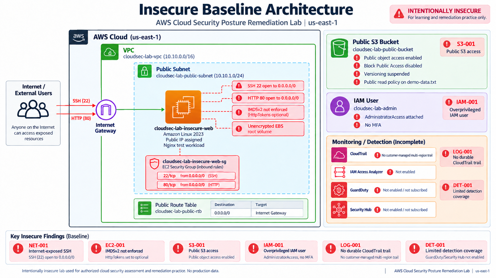

# AWS Cloud Security Posture Assessment & Remediation

A threat-informed AWS security engineering project demonstrating how cloud security weaknesses can be identified, validated, prioritized by business risk, remediated with Terraform, and independently verified using AWS-native controls, Prowler, ScoutSuite, AWS CLI, and runtime testing.

> **Purpose:** build a realistic before-and-after AWS security assessment rather than a scanner-only lab. The project starts from an intentionally insecure workload, validates the exposure, implements remediation as code, and proves the resulting control improvements with multiple independent evidence sources.

---

## Executive Summary

A growing digital services company has migrated a customer-facing workload to AWS and is preparing to handle more sensitive customer and operational data.

Before expanding the environment, a security review is performed to answer four questions:

1. What security weaknesses currently exist?
2. Which weaknesses represent meaningful business risk?
3. How should those weaknesses be remediated in a repeatable way?
4. Can the remediation be independently verified?

The assessment identified material risks across identity, public object storage, administrative network exposure, audit logging, EC2 metadata protection, encryption at rest, and security visibility.

Terraform was then used to harden the environment while preserving the original insecure infrastructure definition for comparison.

The goal is not to produce a perfect CSPM score. The goal is to demonstrate that specific attack paths and control weaknesses were materially reduced and that residual risk remains visible.

---

## Key Outcomes

| Security Area | Insecure Baseline | Hardened State |
|---|---|---|
| IAM | Privileged console user with `AdministratorAccess` and no MFA | Vulnerable project identity removed |
| Administrative access | Public SSH on TCP/22 | Public SSH removed; AWS Systems Manager used |
| EC2 metadata | IMDSv1 permitted | IMDSv2 required |
| EBS encryption | Root volume unencrypted | Root volume encrypted |
| EBS account setting | Encryption by default disabled | Encryption by default enabled |
| S3 exposure | Anonymous object access returned HTTP 200 | Anonymous access returns HTTP 403 |
| S3 protection | Block Public Access disabled | Block Public Access enabled |
| Audit logging | No durable customer-managed CloudTrail trail | Active multi-Region customer-managed trail |
| Access analysis | IAM Access Analyzer absent | Account-level analyzer active |
| Terraform drift | Not applicable | No changes detected after remediation |

---

## Project Status

| Phase | Status |
|---|---|
| Insecure AWS baseline deployment | Complete |
| Manual baseline validation | Complete |
| Prowler baseline assessment | Complete |
| ScoutSuite baseline assessment | Complete |
| Risk analysis and prioritization | Complete |
| Terraform remediation | Complete |
| Post-remediation manual validation | Complete |
| Prowler post-remediation assessment | Complete |
| ScoutSuite post-remediation assessment | In progress |
| Final secure architecture diagram | Pending |
| Final residual-risk review | Pending |

---

## Skills Demonstrated

- AWS security architecture
- Terraform and Infrastructure as Code
- IAM security and least-privilege design
- EC2 hardening
- AWS Systems Manager
- S3 security
- CloudTrail
- IAM Access Analyzer
- encryption at rest
- network exposure reduction
- cloud security posture management
- Prowler
- ScoutSuite
- AWS CLI validation
- risk analysis and prioritization
- remediation planning
- before/after validation
- evidence handling and sanitization
- residual risk analysis

---

## Assessment Methodology

```text
Business Scenario
       |
       v
Deploy Intentionally Insecure AWS Baseline
       |
       v
Automated Assessment
Prowler + ScoutSuite
       |
       v
Manual AWS Validation
       |
       v
Risk Analysis & Prioritization
       |
       v
Terraform Security Remediation
       |
       v
Post-Remediation Validation
       |
       v
Prowler + ScoutSuite Reassessment
       |
       v
Before / After Comparison
       |
       v
Residual Risk & Recommendations
```

Automated findings are not treated as unquestionable truth. Each material finding is reviewed to distinguish between:

- **Exposure:** a vulnerable or unnecessarily permissive condition exists.
- **Exploitability:** the condition could be abused under realistic circumstances.
- **Compromise:** evidence shows unauthorized activity actually occurred.
- **Business impact:** the plausible effect on confidentiality, integrity, availability, auditability, or operations.

A vulnerable configuration does not automatically prove successful exploitation or compromise.

---

## Insecure Baseline Architecture



The intentionally vulnerable baseline includes:

- public VPC and subnet
- Internet-facing EC2 workload
- HTTP access from the Internet
- SSH exposed to `0.0.0.0/0`
- IMDSv1 permitted because metadata tokens are optional
- unencrypted EC2 root EBS volume
- regional EBS encryption by default disabled
- publicly readable S3 object
- S3 Block Public Access disabled
- privileged IAM console user
- AWS-managed `AdministratorAccess` attached to the lab IAM user
- MFA disabled for the lab IAM user
- no durable customer-managed CloudTrail trail
- no IAM Access Analyzer

The insecure configuration exists only for controlled security assessment and must not be treated as a production design.

---

## Risk Register

Seven primary project risks were selected for remediation.

| ID | Finding | Severity | Primary Business Risk |
|---|---|---:|---|
| IAM-001 | Privileged IAM console user with AdministratorAccess and no MFA | Critical | Account takeover and privilege abuse |
| S3-001 | Publicly readable S3 object | High | Unauthorized data exposure |
| NET-001 | SSH exposed to the Internet | High | Remote administrative attack surface |
| LOG-001 | No durable customer-managed CloudTrail trail | High | Reduced forensic and audit capability |
| EC2-001 | IMDSv2 not enforced | Medium | Metadata credential theft |
| EC2-002 | EC2 root EBS volume unencrypted | Medium | Data exposure at rest |
| DET-001 | Limited AWS-native access and threat detection | Medium | Reduced visibility into suspicious access |

Detailed project documentation:

- [`docs/project-scope.md`](docs/project-scope.md)
- [`docs/risk-model.md`](docs/risk-model.md)
- [`docs/risk-register.md`](docs/risk-register.md)
- [`docs/remediation-plan.md`](docs/remediation-plan.md)

---

## Terraform Architecture

The repository preserves separate infrastructure definitions for the intentionally insecure baseline and the hardened target state:

```text
terraform/
├── insecure/
└── secure/
```

`terraform/insecure/` preserves the assessment baseline.

`terraform/secure/` contains the remediated target architecture.

This makes the security changes reviewable as infrastructure code instead of relying on undocumented console changes.

---

## Security Remediation

### IAM-001: Privileged IAM User

**Before**

- dedicated project IAM console user
- `AdministratorAccess`
- console authentication
- MFA disabled

**After**

- vulnerable project IAM user removed
- EC2 administration moved to AWS Systems Manager
- EC2 instance receives only the permissions required for Systems Manager

The project does not claim that every IAM issue in the AWS account was remediated. Scanner findings associated with identities outside the Terraform-managed workload remain documented as account-level residual risk.

---

### NET-001: Internet-Exposed SSH

**Before**

```text
TCP/22 -> 0.0.0.0/0
TCP/80 -> 0.0.0.0/0
```

**After**

```text
TCP/80 -> 0.0.0.0/0
TCP/22 -> Removed
```

Public SSH administration was removed entirely rather than merely restricted to a smaller source range. AWS Systems Manager is used instead for instance administration.

---

### EC2-001: Instance Metadata Protection

**Before**

```text
HttpTokens = optional
IMDSv1 permitted
```

**After**

```text
HttpTokens = required
IMDSv2 required
Metadata hop limit = 1
```

This reduces the risk of temporary IAM role credential theft through metadata-service abuse.

---

### EC2-002: EBS Encryption

**Before**

- root EBS volume unencrypted
- regional EBS encryption by default disabled

**After**

- root EBS volume encrypted
- regional EBS encryption by default enabled

---

### S3-001: Public Object Exposure

**Before**

- anonymous object access allowed
- public read policy
- S3 Block Public Access disabled
- versioning suspended

**After**

- anonymous access denied
- all bucket-level Block Public Access controls enabled
- public read permission removed
- TLS-only bucket policy
- versioning enabled
- explicit AES256 server-side encryption

Manual anonymous-access testing changed from:

```text
HTTP 200
```

to:

```text
HTTP 403
```

---

### LOG-001: Durable Audit Logging

AWS CloudTrail Event History was available in the baseline environment, but there was no durable customer-managed trail.

The hardened architecture adds:

- multi-Region CloudTrail
- global service events
- management event logging
- active logging
- log-file integrity validation
- dedicated S3 audit-log storage
- S3 versioning
- defined log-retention lifecycle

CloudTrail Event History and a durable customer-managed audit trail are intentionally treated as different security capabilities.

---

### DET-001: Access and Threat Detection

IAM Access Analyzer was absent from the baseline environment.

The hardened environment adds an account-level Access Analyzer for continuous external-access analysis.

GuardDuty and Security Hub were not enabled because the assessed AWS account returned service subscription errors. For that reason, DET-001 remains **partially remediated** rather than being presented as fully closed.

---

## Manual Post-Remediation Validation

The hardened environment was validated independently through AWS CLI and runtime testing.

| Control | Before | After |
|---|---|---|
| Project IAM admin user | AdministratorAccess, no MFA | Removed |
| SSH exposure | TCP/22 from `0.0.0.0/0` | Removed |
| Administrative access | Public SSH | AWS Systems Manager |
| Instance metadata | Tokens optional | IMDSv2 required |
| Root EBS encryption | Disabled | Enabled |
| Regional EBS encryption default | Disabled | Enabled |
| Anonymous S3 access | HTTP 200 | HTTP 403 |
| S3 Block Public Access | Disabled | Enabled |
| S3 versioning | Suspended | Enabled |
| Customer-managed CloudTrail | Absent | Active multi-Region trail |
| IAM Access Analyzer | Absent | Active |
| Terraform drift | N/A | No changes |

Terraform post-remediation validation returned:

```text
No changes. Your infrastructure matches the configuration.
```

The hardened EC2 workload was confirmed running, while the original insecure workload was confirmed terminated.

Sanitized validation evidence is stored under [`evidence/`](evidence/).

---

## Prowler Assessment

Both baseline and post-remediation assessments were performed with **Prowler 5.42.0** in `us-east-1`.

Using the same scanner version helps ensure that the comparison reflects infrastructure changes rather than scanner-version changes.

### Overall Account Results

| Assessment | Checks Executed | Passed | Failed |
|---|---:|---:|---:|
| Baseline | 648 | 94 | 107 |
| Post-remediation | 648 | 142 | 99 |

The account-wide totals are not used as the primary measure of project success because Prowler also evaluates:

- resources outside this Terraform project
- unrelated IAM identities
- account-level controls
- security resources added during remediation

Project success is therefore measured against the controls mapped to the risk register.

### Project-Specific Prowler Results

| Finding | Prowler Check | Before | After |
|---|---|---|---|
| IAM-001 | `iam_user_administrator_access_policy` | FAIL | Project identity removed |
| IAM-001 | `iam_user_mfa_enabled_console_access` | FAIL | Project identity removed |
| S3-001 | `s3_bucket_public_access` | FAIL | PASS |
| S3-001 | `s3_bucket_level_public_access_block` | FAIL | PASS |
| NET-001 | `ec2_instance_port_ssh_exposed_to_internet` | FAIL | PASS |
| NET-001 | `ec2_securitygroup_allow_ingress_from_internet_to_tcp_port_22` | FAIL | PASS |
| EC2-001 | `ec2_instance_imdsv2_enabled` | FAIL | PASS |
| EC2-002 | `ec2_ebs_volume_encryption` | Baseline weakness | PASS |
| EC2-002 | `ec2_ebs_default_encryption` | Baseline weakness | PASS |
| LOG-001 | `cloudtrail_multi_region_enabled` | FAIL | PASS |
| DET-001 | `accessanalyzer_enabled` | FAIL | PASS |

Detailed sanitized comparison:

[`assessments/prowler/prowler-before-after.md`](assessments/prowler/prowler-before-after.md)

The intentionally vulnerable project IAM user was deleted during remediation, so its post-remediation IAM finding disappears rather than becoming a PASS row. Other IAM findings in the AWS account are not misrepresented as project failures or silently altered without separate scope.

---

## ScoutSuite Assessment

ScoutSuite provides a second independent security assessment.

The baseline assessment confirmed multiple project risks, including:

- IAM managed policy allowing full privileges
- IAM user without MFA
- world-readable S3 access through bucket policy
- security group exposing SSH to the Internet
- CloudTrail not configured
- unencrypted EBS storage
- EBS encryption by default disabled

The post-remediation ScoutSuite assessment is currently in progress.

Sanitized ScoutSuite material is maintained under:

```text
assessments/scoutsuite/
```

Scanner findings that refer to unrelated account-wide resources are kept separate from the project risk register.

---

## Evidence Strategy

Raw scanner reports and raw AWS runtime evidence are intentionally excluded from version control.

Raw data may contain:

- AWS account IDs
- ARNs
- EC2 instance IDs
- security group IDs
- EBS volume IDs
- bucket names
- public IP addresses
- DNS names
- IAM identity information
- Terraform runtime metadata

Only sanitized evidence suitable for public publication is committed.

Published evidence is organized under:

```text
evidence/
├── iam/
├── ec2/
├── s3/
├── logging/
├── detection/
└── remediation/
```

Raw material is retained separately under ignored paths for local validation.

---

## Repository Structure

```text
aws-cloud-security-posture-remediation/
│
├── assessments/
│   ├── prowler/
│   │   ├── before/
│   │   ├── after/
│   │   └── prowler-before-after.md
│   │
│   └── scoutsuite/
│       ├── before/
│       └── after/
│
├── docs/
│   ├── diagrams/
│   ├── project-scope.md
│   ├── remediation-plan.md
│   ├── risk-model.md
│   └── risk-register.md
│
├── evidence/
│   ├── iam/
│   ├── ec2/
│   ├── s3/
│   ├── logging/
│   ├── detection/
│   ├── remediation/
│   └── raw/
│
├── terraform/
│   ├── insecure/
│   └── secure/
│
├── .gitignore
└── README.md
```

---

## Security Validation Philosophy

This project does not treat a scanner finding as proof of compromise.

A finding can demonstrate that a vulnerable condition exists, but it does not automatically prove:

- exploitation occurred
- credentials were stolen
- unauthorized access occurred
- data was exfiltrated
- persistence was established

The project therefore combines multiple evidence sources:

```text
Terraform Configuration
        +
AWS CLI / API Validation
        +
Runtime Connectivity Testing
        +
Prowler
        +
ScoutSuite
        =
Higher-Confidence Security Assessment
```

The strongest conclusions are those supported by more than one independent validation method.

---

## Residual Risk

Not every AWS account-level issue is modified by this project.

Examples include IAM findings associated with identities outside the Terraform-managed workload. These remain visible as account-level residual risks rather than being silently changed or incorrectly attributed to the project.

DET-001 also remains partially remediated because IAM Access Analyzer is active while GuardDuty and Security Hub remain unavailable in the assessed account due to service subscription restrictions.

Production environments should additionally consider:

- Amazon GuardDuty
- AWS Security Hub
- AWS Config
- centralized security logging
- AWS Organizations
- organization-level Service Control Policies
- centralized workforce identity federation
- phishing-resistant MFA
- customer-managed KMS keys
- AWS Backup with tested recovery procedures
- immutable or separately administered audit-log storage
- CloudWatch alerting and detection engineering
- cross-account security monitoring

---

## Key Security Engineering Principles Demonstrated

### 1. Findings require context

Scanner output must be mapped to the actual resource and business risk before remediation decisions are made.

### 2. Security changes should be repeatable

Terraform converts remediation into reviewable infrastructure code rather than undocumented console changes.

### 3. Removing an attack path is often stronger than restricting it

Public SSH was removed instead of simply narrowing the allowed source range.

### 4. Auditability must be intentionally designed

CloudTrail Event History provides useful visibility, but it is not equivalent to a durable organization-controlled audit trail.

### 5. Validation should be independent

The hardened configuration is tested through Terraform, AWS APIs, runtime testing, Prowler, and ScoutSuite.

### 6. Residual risk should remain visible

A professional assessment documents what remains unresolved rather than presenting an artificially perfect environment.

---

## Technologies

| Technology | Purpose |
|---|---|
| AWS | Cloud infrastructure |
| Terraform | Infrastructure as Code and security remediation |
| Prowler | AWS security posture assessment |
| ScoutSuite | Independent cloud security assessment |
| AWS CLI | Manual control validation |
| IAM | Identity and access management |
| EC2 | Demonstration workload |
| AWS Systems Manager | Administrative access without public SSH |
| S3 | Object storage and CloudTrail log storage |
| CloudTrail | AWS API audit logging |
| IAM Access Analyzer | External-access analysis |
| Git / GitHub | Version control and portfolio documentation |

---

## Safe Reproduction

The `terraform/insecure/` configuration deliberately creates vulnerable AWS resources.

Do not deploy it into a production account.

Before using this repository:

1. use a dedicated AWS sandbox account;
2. review every Terraform plan before applying it;
3. understand the resources that may generate AWS charges;
4. keep Terraform state and scanner raw output out of version control;
5. destroy temporary lab resources when assessment work is complete.

The repository's `.gitignore` is designed to keep common Terraform state, raw assessment reports, and runtime evidence out of Git.

---

## Disclaimer

This repository contains intentionally vulnerable AWS infrastructure created solely for controlled security education and assessment.

No AWS credentials, Terraform state files, raw security-scanner reports, secrets, or sensitive runtime identifiers are intentionally committed to this repository.

AWS resources may incur costs while deployed.

---

## Author

**Arcel Mukadi**

Cloud infrastructure and cybersecurity professional focused on AWS cloud security, infrastructure security, threat detection, incident response, and security automation.
